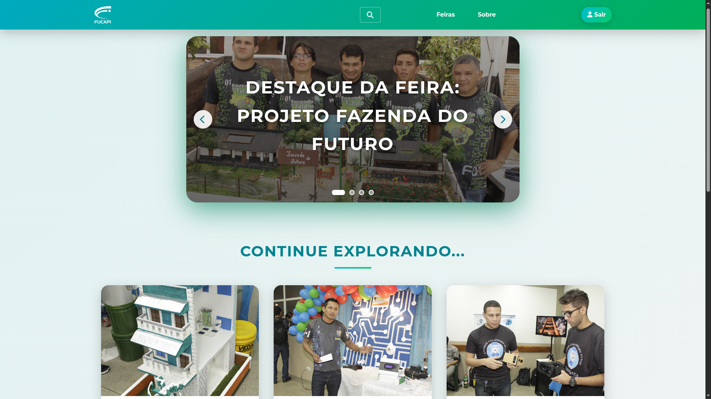
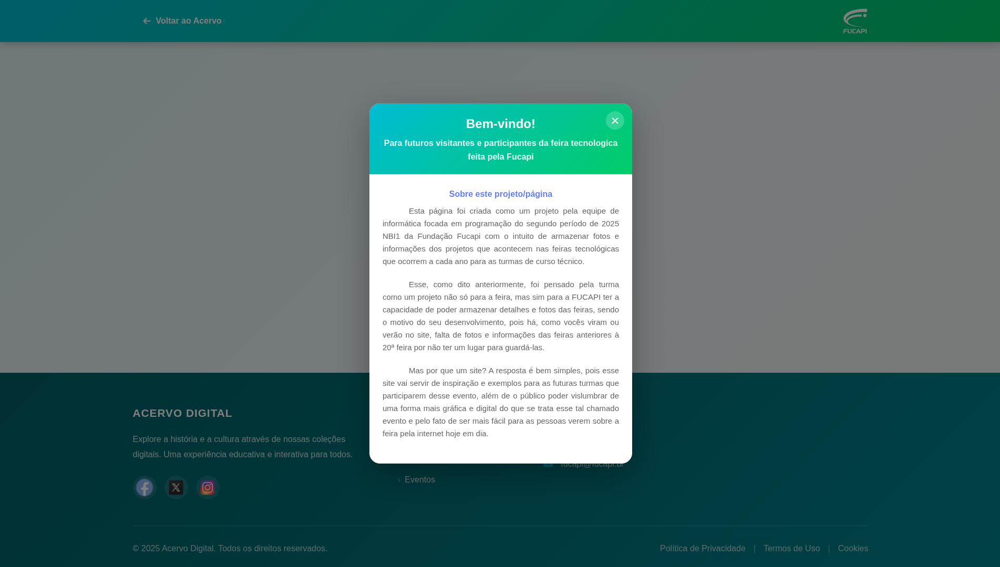
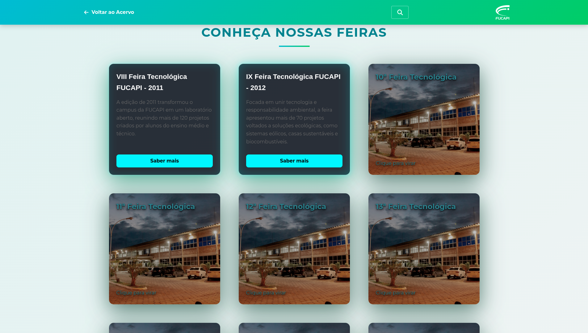
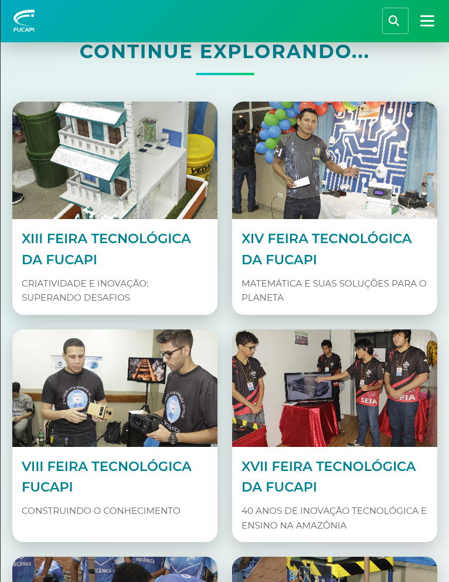
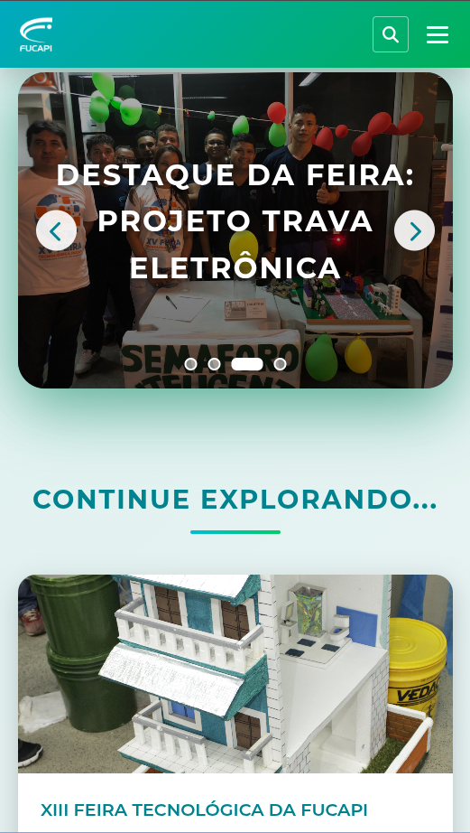
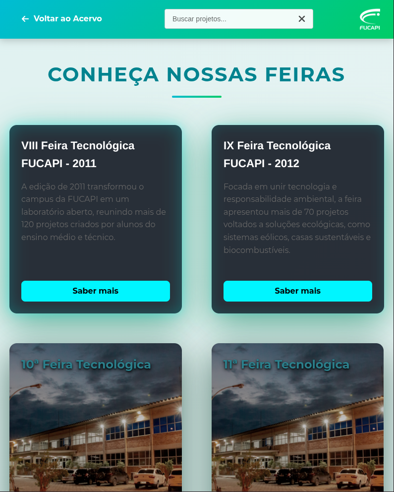
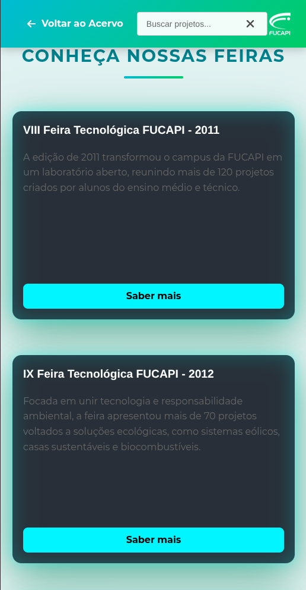
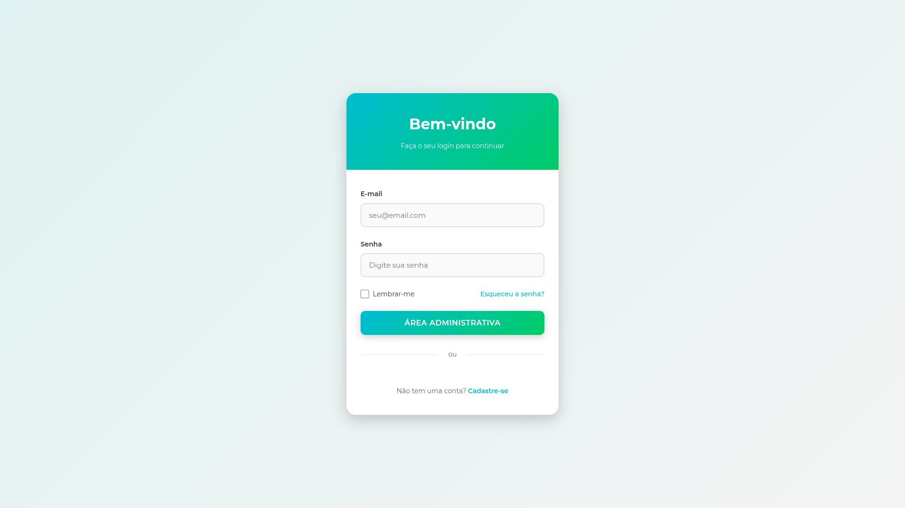
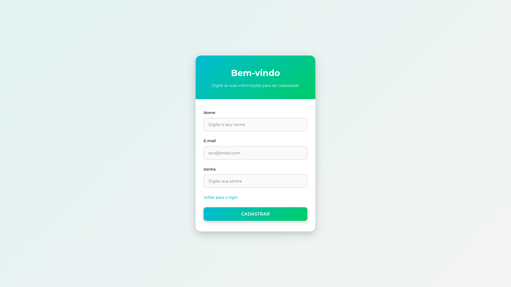

# Acervo Digital FUCAPI

<p align="center">
  
</p>

<p align="center">
  <strong>Repositório virtual dedicado à preservação de 20 anos de história, inovação e conhecimento das Feiras Tecnológicas da FUCAPI</strong>
</p>

<p align="center">
  <a href="https://developer.mozilla.org/pt-BR/docs/Web/HTML"></a>
  <a href="https://developer.mozilla.org/pt-BR/docs/Web/CSS"></a>
  <a href="https://developer.mozilla.org/pt-BR/docs/Web/JavaScript"></a>
  <a href="https://www.php.net/"></a>
  <a href="https://www.mysql.com/"></a>
  
</p>

---

## Preview do Sistema

<p align="center">
  
  
  
</p>

---

## Sumário

1. [Sobre o Projeto](#sobre-o-projeto)
2. [Tecnologias Utilizadas](#tecnologias-utilizadas)
3. [Arquitetura e Infraestrutura](#arquitetura-e-infraestrutura)
4. [Estrutura do Projeto](#estrutura-do-projeto)
5. [Instalação e Configuração](#instalação-e-configuração)
6. [Funcionalidades](#funcionalidades)
7. [Requisitos do Sistema](#requisitos-do-sistema)
8. [Screenshots](#screenshots)
9. [Equipe](#equipe)
10. [Como Contribuir](#como-contribuir)
11. [Licença](#licença)
12. [Contato](#contato)

---

## Sobre o Projeto

O **Acervo Digital** é um sistema web full-stack desenvolvido pela turma NBI1 do curso de Informática com Ênfase em Programação da FUCAPI. O projeto foi concebido para atender uma demanda institucional: a ausência de um repositório centralizado que documentasse e disponibilizasse o histórico das Feiras Tecnológicas realizadas pela instituição ao longo de duas décadas.

### Contexto e Motivação

Antes da implementação deste sistema, não existia uma plataforma onde alunos, professores e visitantes pudessem consultar informações sobre os projetos apresentados nas feiras anteriores. Esta lacuna dificultava o acesso ao conhecimento acumulado e limitava a valorização da produção acadêmica desenvolvida ao longo dos anos.

### Solução Implementada

Foi desenvolvida uma aplicação web completa, com frontend responsivo e backend robusto, capaz de gerenciar, armazenar e disponibilizar informações detalhadas sobre todas as edições das Feiras Tecnológicas da FUCAPI, desde 2011 até 2024.

### Objetivos

- Preservar a memória institucional das Feiras Tecnológicas
- Valorizar a produção acadêmica dos estudantes
- Facilitar o acesso centralizado ao conhecimento
- Inspirar futuras gerações através dos projetos anteriores
- Promover a continuidade do aprendizado e compartilhamento de ideias

---

## Tecnologias Utilizadas

O projeto foi desenvolvido utilizando um stack completo de tecnologias web, integrando frontend, backend e banco de dados.

### Frontend

- **HTML5** - Estruturação semântica do conteúdo
- **CSS3** - Estilização modular e responsiva
  - Arquitetura CSS organizada em módulos (base, componentes, layout, pages)
  - Media queries para responsividade (400px a 1200px)
  - Sistema de variáveis CSS para manutenibilidade
- **JavaScript (Vanilla)** - Interatividade e dinamismo
  - Módulos para carrossel, busca, animações e navegação
  - Manipulação do DOM
  - Requisições assíncronas

### Backend

- **PHP 7.4+** - Linguagem de programação server-side
  - Controladores para operações CRUD
  - Validação e sanitização de dados
  - Gerenciamento de sessões
  - Lógica de autenticação e autorização

### Banco de Dados

- **MySQL 5.7+** - Sistema de gerenciamento de banco de dados relacional
  - Modelagem de dados para projetos, feiras e usuários
  - Queries otimizadas para performance
  - Integridade referencial através de foreign keys

### Servidor Local

- **XAMPP** - Ambiente de desenvolvimento
  - Apache Web Server
  - MySQL Database Server
  - PHP Interpreter
  - phpMyAdmin para administração do banco

### Ferramentas de Design e Prototipagem

- **Canva** - Criação de protótipos e wireframes
- **VS Code** - Ambiente de desenvolvimento integrado

---

## Arquitetura e Infraestrutura

### Arquitetura do Sistema

O projeto segue uma arquitetura **MVC (Model-View-Controller)** adaptada, separando responsabilidades entre apresentação, lógica de negócio e persistência de dados.

```
┌─────────────────────────────────────────────┐
│           CAMADA DE APRESENTAÇÃO            │
│  (HTML, CSS, JavaScript - Frontend)         │
└─────────────────┬───────────────────────────┘
                  │
                  │ HTTP Requests
                  │
┌─────────────────▼───────────────────────────┐
│         CAMADA DE APLICAÇÃO                 │
│  (PHP Controllers - Backend Logic)          │
│  • cadastrar.php  • login.php               │
│  • store.php      • update.php              │
│  • delete.php     • edit.php                │
└─────────────────┬───────────────────────────┘
                  │
                  │ SQL Queries
                  │
┌─────────────────▼───────────────────────────┐
│         CAMADA DE PERSISTÊNCIA              │
│  (MySQL Database - Data Storage)            │
│  • Tabela de Projetos                       │
│  • Tabela de Feiras                         │
│  • Tabela de Usuários                       │
└─────────────────────────────────────────────┘
```

### Fluxo de Dados

1. **Cliente** → Navegador web acessa a aplicação
2. **Frontend** → Interface responsiva renderiza o conteúdo
3. **Requisição** → JavaScript envia dados via HTTP
4. **Backend** → PHP processa e valida as informações
5. **Banco de Dados** → MySQL armazena/recupera dados
6. **Resposta** → Dados retornam ao cliente em formato JSON/HTML

### Configuração do Servidor Local

A implementação do servidor local foi fundamental para o desenvolvimento do projeto. Utilizou-se o **XAMPP** como solução integrada, que forneceu:

#### Apache HTTP Server
- Servidor web responsável por processar requisições HTTP/HTTPS
- Configuração de virtual hosts para ambiente de desenvolvimento
- Suporte a módulos PHP através do mod_php

#### MySQL Server
- Banco de dados relacional para persistência
- Gerenciamento através do phpMyAdmin
- Configuração de usuários e privilégios

#### PHP Interpreter
- Processamento de scripts server-side
- Integração com MySQL através de PDO/MySQLi
- Gerenciamento de sessões e cookies

### Integração Backend-Frontend

A comunicação entre frontend e backend foi implementada através de:

- **Requisições AJAX** para operações assíncronas
- **Formulários HTML** com validação client-side e server-side
- **JSON** como formato de troca de dados
- **Sessões PHP** para gerenciamento de autenticação

---

## Estrutura do Projeto

```
Acervo/
└── main/
    ├── assets/
    │   ├── css/                    # Arquivos de estilização
    │   │   ├── base/               # Reset, variáveis, estilos globais
    │   │   ├── componentes/        # Componentes reutilizáveis
    │   │   │   ├── cards/          # Cards de projetos
    │   │   │   ├── carrossel/      # Carrossel da homepage
    │   │   │   ├── footer/         # Rodapé
    │   │   │   └── header/         # Cabeçalho e navegação
    │   │   ├── feiras/             # Estilos das páginas de feiras
    │   │   ├── layout/             # Grid system e sections
    │   │   ├── pages/              # Estilos de páginas específicas
    │   │   ├── responsive/         # Media queries (400px - 1200px)
    │   │   └── sobre/              # Estilos da página sobre
    │   │
    │   ├── img/                    # Recursos visuais
    │   │   ├── Cards/              # Imagens dos cards
    │   │   ├── Carrosel/           # Imagens do carrossel
    │   │   ├── Logos/              # Logotipo e ícones sociais
    │   │   └── readme/             # Imagens para documentação
    │   │
    │   ├── js/                     # Scripts JavaScript
    │   │   ├── feira/              # Lógica específica das feiras
    │   │   ├── modules/            # Módulos reutilizáveis
    │   │   │   ├── animacoes.js    # Animações e transições
    │   │   │   ├── busca.js        # Sistema de busca
    │   │   │   ├── carrossel.js    # Controle do carrossel
    │   │   │   ├── menu-mobile.js  # Menu responsivo
    │   │   │   ├── scroll.js       # Comportamento de scroll
    │   │   │   └── sugestao.js     # Sistema de sugestões
    │   │   ├── pages/              # Scripts de páginas específicas
    │   │   ├── sobre/              # Scripts da página sobre
    │   │   └── main.js             # Script principal
    │   │
    │   └── pages/                  # Templates HTML
    │       ├── feiras/
    │       │   ├── feira-adm/      # Interface administrativa (2011-2024)
    │       │   └── feira-publi/    # Interface pública (2011-2024)
    │       └── links/              # Páginas auxiliares
    │
    ├── controller/                 # Controladores PHP (Backend)
    │   ├── cadastrar.php           # Registro de novos usuários
    │   ├── delete.php              # Exclusão de projetos
    │   ├── edit.php                # Edição de projetos
    │   ├── login.php               # Autenticação de usuários
    │   ├── store.php               # Armazenamento de dados
    │   └── update.php              # Atualização de registros
    │
    ├── server/                     # Configurações do servidor
    │   └── db.php                  # Conexão com banco de dados
    │
    ├── view/                       # Camada de visualização
    │   └── index.html              # Template principal
    │
    ├── index.php                   # Ponto de entrada da aplicação
    └── README.md                   # Documentação do projeto
```

---

## Instalação e Configuração

### Pré-requisitos

Antes de iniciar, certifique-se de ter instalado:

- **XAMPP** (versão 7.4 ou superior)
  - Apache Web Server
  - MySQL Database
  - PHP 7.4+
- **Navegador web moderno** (Chrome, Firefox, Edge, Safari)
- **Editor de código** (VS Code recomendado)
- **Git** (opcional, para versionamento)

### Passo 1: Instalação do XAMPP

1. Baixe o XAMPP em [https://www.apachefriends.org](https://www.apachefriends.org)
2. Execute o instalador e siga as instruções
3. Instale no diretório padrão (geralmente `C:\xampp` no Windows)
4. Inicie o painel de controle do XAMPP

### Passo 2: Configuração do Ambiente

1. **Clone ou baixe o repositório**
   ```bash
   git clone https://github.com/Matheus-Sounier/Acervo-Digital.git
   ```

2. **Mova o projeto para o diretório do servidor**
   - Copie a pasta do projeto para `C:\xampp\htdocs\`
   - O caminho final deve ser: `C:\xampp\htdocs\Acervo\main\`

3. **Inicie os serviços no XAMPP**
   - Abra o painel de controle do XAMPP
   - Clique em "Start" para Apache
   - Clique em "Start" para MySQL

### Passo 3: Configuração do Banco de Dados

1. **Acesse o phpMyAdmin**
   - Abra o navegador e acesse: `http://localhost/phpmyadmin`

2. **Crie o banco de dados**
   ```sql
   CREATE DATABASE acervo_digital CHARACTER SET utf8mb4 COLLATE utf8mb4_unicode_ci;
   ```

3. **Importe a estrutura do banco** (se houver arquivo SQL)
   - Clique na aba "Importar"
   - Selecione o arquivo `.sql` fornecido
   - Clique em "Executar"

4. **Configure as credenciais de conexão**
   - Abra o arquivo `server/db.php`
   - Ajuste as credenciais conforme necessário:
   ```php
   <?php
   $host = 'localhost';
   $dbname = 'acervo_digital';
   $username = 'root';
   $password = '';  // Deixe vazio para instalação padrão do XAMPP
   
   try {
       $pdo = new PDO("mysql:host=$host;dbname=$dbname;charset=utf8mb4", $username, $password);
       $pdo->setAttribute(PDO::ATTR_ERRMODE, PDO::ERRMODE_EXCEPTION);
   } catch(PDOException $e) {
       die("Erro na conexão: " . $e->getMessage());
   }
   ?>
   ```

### Passo 4: Verificação da Instalação

1. **Teste a conexão com o banco de dados**
   - Crie um arquivo `test-connection.php` na raiz do projeto:
   ```php
   <?php
   require_once 'server/db.php';
   echo "Conexão estabelecida com sucesso!";
   ?>
   ```
   - Acesse: `http://localhost/Acervo/main/test-connection.php`

2. **Acesse a aplicação**
   - Abra o navegador
   - Acesse: `http://localhost/Acervo/main/`
   - A página inicial deve carregar corretamente

### Passo 5: Configurações Adicionais (Opcional)

#### Configurar Virtual Host

Para acessar o projeto através de um domínio personalizado (ex: `acervo.local`):

1. Edite o arquivo `C:\xampp\apache\conf\extra\httpd-vhosts.conf`
2. Adicione:
   ```apache
   <VirtualHost *:80>
       DocumentRoot "C:/xampp/htdocs/Acervo/main"
       ServerName acervo.local
   </VirtualHost>
   ```

3. Edite o arquivo `C:\Windows\System32\drivers\etc\hosts` (como administrador)
4. Adicione: `127.0.0.1 acervo.local`
5. Reinicie o Apache
6. Acesse: `http://acervo.local`

---

## Funcionalidades

### Recursos Principais

#### Para Visitantes (Acesso Público)

- **Busca Avançada** - Localização de projetos por nome, categoria ou ano
- **Visualização Detalhada** - Informações completas sobre cada projeto
- **Linha do Tempo** - Navegação cronológica pelas feiras (2011-2024)
- **Galeria de Projetos** - Exploração visual dos destaques
- **Interface Responsiva** - Adaptação automática a diferentes dispositivos
- **Sistema de Filtros** - Filtragem por edição, categoria e palavra-chave

#### Para Administradores (Área Restrita)

- **Gerenciamento de Projetos** - CRUD completo (Create, Read, Update, Delete)
- **Upload de Imagens** - Adição de fotos dos projetos
- **Gerenciamento de Feiras** - Cadastro de novas edições
- **Controle de Usuários** - Administração de acessos
- **Dashboard Administrativo** - Estatísticas e relatórios
- **Sistema de Autenticação** - Login seguro com sessões PHP

### Histórico das Feiras Documentadas

O acervo contém informações detalhadas de todas as edições:

| Ano  | Edição | Tema                                                      | Projetos |
|------|--------|-----------------------------------------------------------|----------|
| 2011 | 8ª     | Construindo o Conhecimento                                | 120+     |
| 2012 | 9ª     | Inovação e Sustentabilidade                               | 70+      |
| 2013 | 10ª    | Inovar e Empreender                                       | 85+      |
| 2014 | 11ª    | Soluções Inovadoras, Grandes Desafios                     | 85       |
| 2015 | 12ª    | A Sociedade sob a Luz da Inovação                         | 72       |
| 2016 | 13ª    | Criatividade e Inovação: Superando Desafios               | 45       |
| 2017 | 14ª    | Matemática e suas soluções para o planeta                 | N/D*     |
| 2018 | 15ª    | Tecnologias para Redução das Desigualdades                | N/D*     |
| 2019 | 16ª    | Processos Industriais e Tecnologias                       | N/D*     |
| 2022 | 17ª    | 40 anos de inovação tecnológica                           | 30+      |
| 2023 | 18ª    | Inclusão Social e Tecnológica                             | 44       |
| 2024 | 19ª    | Biomas do Amazonas: diversidade, saberes e tecnologias    | 39       |

_*N/D: Dados em processo de catalogação_

### Módulos do Sistema

#### 1. Módulo de Autenticação
- Login de usuários
- Gerenciamento de sessões
- Recuperação de senha
- Validação de permissões

#### 2. Módulo de Projetos
- Cadastro de novos projetos
- Edição de informações
- Exclusão de registros
- Upload de imagens
- Associação com feiras

#### 3. Módulo de Busca
- Busca por texto livre
- Filtros avançados
- Ordenação de resultados
- Sistema de sugestões

#### 4. Módulo de Visualização
- Interface pública
- Detalhamento de projetos
- Galeria de imagens
- Linha do tempo interativa

---

## Requisitos do Sistema

### Requisitos Funcionais

| ID     | Descrição                                                          | Prioridade |
|--------|--------------------------------------------------------------------|------------|
| RF001  | Exibir barra de pesquisa para buscar projetos                      | Essencial  |
| RF002  | Detalhar projeto selecionado com informações completas             | Essencial  |
| RF003  | Permitir visualização de nome, ano, descrição e imagens            | Importante |
| RF004  | Exibir galeria de mídias do projeto                                | Desejável  |
| RF005  | Permitir acesso à documentação adicional dos projetos              | Importante |
| RF006  | Implementar sistema de autenticação para administradores           | Essencial  |
| RF007  | Permitir CRUD completo de projetos (área administrativa)           | Essencial  |
| RF008  | Implementar filtros por ano, categoria e palavra-chave             | Importante |
| RF009  | Gerar linha do tempo interativa das feiras                         | Desejável  |
| RF010  | Permitir upload e gerenciamento de imagens                         | Importante |

### Requisitos Não Funcionais

| ID     | Descrição                                                          | Categoria       |
|--------|--------------------------------------------------------------------|-----------------|
| NF001  | Interface simples, intuitiva e acessível                           | Usabilidade     |
| NF002  | Dados consistentes e sem duplicações                               | Confiabilidade  |
| NF003  | Tempo de carregamento de páginas inferior a 2 segundos             | Performance     |
| NF004  | Apenas administradores podem alterar informações                   | Segurança       |
| NF005  | Compatibilidade com navegadores modernos (Chrome, Firefox, Edge)   | Compatibilidade |
| NF006  | Design responsivo para dispositivos móveis                         | Usabilidade     |
| NF007  | Validação de dados no frontend e backend                           | Segurança       |
| NF008  | Proteção contra injeção SQL através de prepared statements         | Segurança       |
| NF009  | Sistema de backup automatizado do banco de dados                   | Confiabilidade  |
| NF010  | Código limpo e documentado para facilitar manutenção               | Manutenibilidade|

## Screenshots

### Tela Inicial e Responsividade

<table>
  <tr>
    <td align="center">
      
      <br/>
      <em>Full screen da tela home do website</em>
    </td>
    <td align="center">
      
      <br/>
      <em>Responsividade em telas ≤ 768px</em>
    </td>
    <td align="center">
      
      <br/>
      <em>Responsividade em telas ≤ 480px</em>
    </td>
  </tr>
</table>

### Tela Sobre o Acervo

<table>
  <tr>
    <td align="center">
      
      <br/>
      <em>Demonstração da tela sobre do website</em>
    </td>
  </tr>
</table>

### Tela das Feiras Gerais e Responsividade

<table>
  <tr>
    <td align="center">
      
      <br/>
      <em>Demonstração da tela de todas as feiras</em>
    </td>
    <td align="center">
      
      <br/>
      <em>Responsividade em telas ≤ 768px</em>
    </td>
    <td align="center">
      
      <br/>
      <em>Responsividade em telas ≤ 480px</em>
    </td>
  </tr>
</table>

### Área Administrativa

<table>
  <tr>
    <td align="center">
      
      <br/>
      <em>Tela de login para área administrativa</em>
    </td>
    <td align="center">
      
      <br/>
      <em>Tela de cadastro de novos usuários</em>
    </td>
  </tr>
</table>

---

## Equipe

### Desenvolvimento

**Turma NBI1** - Informática com Ênfase em Programação  
Fundação Centro de Análise, Pesquisa e Inovação Tecnológica - FUCAPI

### Documentação de Requisitos

- Matheus dos Santos Sounier
- Leonardo Gomes
- Antony Roscy
- Luana Carvalho
- Fernanda Oliveira

### Responsabilidades Técnicas

- **Frontend** - HTML, CSS, JavaScript
- **Backend** - PHP, MySQL, Integração XAMPP
- **Design** - Prototipagem no Canva, UI/UX
- **Infraestrutura** - Configuração do servidor local Apache/MySQL
- **Banco de Dados** - Modelagem e implementação em MySQL

---

## Como Contribuir

O Acervo Digital foi idealizado para crescer continuamente, incorporando projetos de futuras edições das Feiras Tecnológicas.

### Para Estudantes da FUCAPI

1. Entre em contato com a coordenação da escola
2. Reúna informações sobre os novos projetos
3. Organize o material (descrições, imagens, vídeos)
4. Submeta as informações através da área administrativa

### Para Desenvolvedores

1. Faça um fork do repositório
2. Crie uma branch para sua funcionalidade:
   ```bash
   git checkout -b feature/nova-funcionalidade
   ```
3. Commit suas alterações:
   ```bash
   git commit -m 'Adiciona nova funcionalidade X'
   ```
4. Push para a branch:
   ```bash
   git push origin feature/nova-funcionalidade
   ```
5. Abra um Pull Request detalhando as mudanças

### Padrões de Contribuição

- Siga os padrões de código existentes
- Documente novas funcionalidades
- Teste antes de submeter
- Escreva commits descritivos em português
- Mantenha a consistência visual e de arquitetura

---

## Licença

Este projeto foi desenvolvido para fins educacionais pela turma NBI1 da FUCAPI. Todo o conteúdo, informações e materiais são de propriedade da instituição e foram oficialmente cedidos para a criação deste acervo.

**Uso Institucional** - O sistema é de uso exclusivo da FUCAPI para fins educacionais e de preservação histórica.

---

## Agradecimentos

Este projeto não seria possível sem o apoio e colaboração de diversas pessoas e setores da FUCAPI:

- **Professora Orientadora Adiane** - Pelo suporte técnico e pedagógico durante todo o desenvolvimento
- **Coordenação Institucional** - Por acreditar no potencial do projeto e disponibilizar informações sobre feiras anteriores
- **Alunos das Feiras Anteriores** - Cujos projetos inspiraram e justificaram esta iniciativa
- **Equipes Colaboradoras** - Equipe de design, testes e análise de planejamento, que auxiliaram a concluir este projeto

---

## Contato

**FUCAPI** - Fundação Centro de Análise, Pesquisa e Inovação Tecnológica

Av. Governador Danilo de Matos Areosa, 381  
Distrito Industrial - Manaus/AM - CEP: 69075-351  
Email: [fucapimidias@gmail.com ](mailto:fucapimidias@gmail.com )  
Website: [www.fucapi.br](https://fucapi.edu.br/)  
Telefone: (92) 2101-5000

### Redes Sociais

[](https://www.instagram.com/fucapioficial/)
[](https://www.facebook.com/fucapioficial)
[](https://www.linkedin.com/school/fucapi-am/posts/?feedView=all)

---

## Considerações Finais

O Acervo Digital transcende a simples categorização como "site" ou "sistema". Trata-se de uma iniciativa voltada à preservação da memória institucional, desenvolvida com dedicação, pesquisa aprofundada e trabalho colaborativo.

A implementação do backend com PHP e MySQL, integrada ao servidor Apache através do XAMPP, foi fundamental para criar uma solução robusta e escalável. Esta arquitetura permite não apenas consultar informações históricas, mas também gerenciar dinamicamente o conteúdo, garantindo que o acervo permaneça atualizado e relevante.

A escolha por desenvolver um sistema full-stack, mesmo com predominância de trabalho no frontend, demonstra a compreensão da importância de uma solução completa e profissional. A integração entre todas as camadas (apresentação, lógica de negócio e persistência) resulta em uma aplicação coesa e funcional.

Este projeto serve como referência para futuras turmas, evidenciando como a tecnologia pode ser empregada para preservar e disseminar o legado institucional de maneira acessível, moderna e duradoura. O acervo permanecerá vivo e em constante evolução, refletindo o crescimento coletivo e a trajetória acadêmica da FUCAPI.

## Reportar Problemas

Encontrou um bug ou tem uma sugestão? 

1. Verifique se o problema já não foi reportado nas [Issues](https://github.com/Matheus-Sounier/Acervo-Digital/issues)
2. Crie uma nova issue com:
   - Descrição clara do problema
   - Passos para reproduzir
   - Screenshots (se aplicável)
   - Informações do ambiente (navegador, SO, versão)

---

## Reconhecimentos

Este projeto foi desenvolvido como parte do currículo do curso de **Informática com Ênfase em Programação** da FUCAPI e representa não apenas um trabalho acadêmico, mas um compromisso com a preservação da história institucional.

## Glossário

- **CRUD** - Create, Read, Update, Delete (Criar, Ler, Atualizar, Deletar)
- **MVC** - Model-View-Controller (padrão arquitetural)
- **Frontend** - Parte visual da aplicação que o usuário interage
- **Backend** - Lógica de servidor e processamento de dados
- **API** - Application Programming Interface (Interface de Programação de Aplicações)
- **PDO** - PHP Data Objects (camada de abstração para banco de dados)
- **XAMPP** - Cross-platform, Apache, MySQL, PHP, Perl

---

## Links Úteis

- [Documentação PHP](https://www.php.net/docs.php)
- [Documentação MySQL](https://dev.mysql.com/doc/)
- [MDN Web Docs](https://developer.mozilla.org/)
- [XAMPP Documentation](https://www.apachefriends.org/docs/)
- [Git Documentation](https://git-scm.com/doc)

---

## Termos de Uso

Este sistema foi desenvolvido exclusivamente para uso interno da FUCAPI. Qualquer uso, reprodução ou distribuição do código-fonte, design ou conteúdo sem autorização expressa da instituição é estritamente proibido.

### Direitos Autorais

© 2024 FUCAPI - Fundação Centro de Análise, Pesquisa e Inovação Tecnológica  
Todos os direitos reservados.

### Política de Privacidade

Os dados armazenados neste sistema são de propriedade da FUCAPI e são utilizados exclusivamente para fins educacionais e de preservação histórica. Nenhuma informação pessoal é compartilhada com terceiros.

---

<div align="center">

### Desenvolvido pela Turma NBI1 - FUCAPI 2024

**Preservando o passado, inspirando o futuro**


---

[](#acervo-digital-fucapi)

</div>